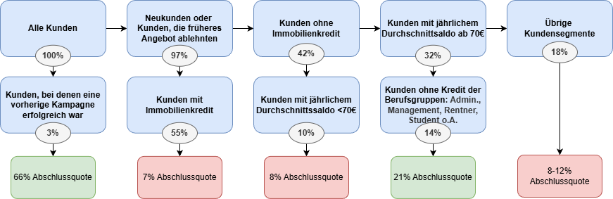

# Bank Marketing – Kundensegmentierung für höhere Abschlusseffizienz

## Einleitung & Ziel

Dieses Projekt analysiert Daten einer portugiesischen Bank aus einer Telefon-Marketing-Kampagne, bei der Kunden für eine Festgeldanlage geworben wurden.

**Zentrale Fragestellung:**\
Welche Kundensegmente bieten das **höchste Potenzial** für Vertragsabschlüsse und wie kann die Bank ihre Ressourcen (Kontakte) gezielter einsetzen, um die **Abschlussquote** zu steigern und gleichzeitig den **Aufwand** (Anzahl angerufener Kunden) zu senken?

**Datenquelle**\
UCI Machine Learning Repository – [Bank Marketing Dataset](https://archive.ics.uci.edu/dataset/222/bank+marketing)\
\~45.200 Datensätze, binäres Ziel: `y` = „yes“ (Abschluss) / „no“ (kein Abschluss)

Verwendete Merkmale (Auswahl): Alter, Beruf, Familienstand, Bildung, Kontostand, Wohnungs-/Privatkredit, Outcome vorheriger Kampagnen, Anzahl vorheriger Kontakte.

**Aktueller Projektfokus:** Identifikation der vielversprechendsten Kundensegmente mittels interpretierbarer Entscheidungsbäume.

## Wichtigste Ergebnisse

Insgesamt schlossen 11.7% der Kunden während der Kampagne einen Vertrag ab. Durch systematische Variation von Modellparametern (Kostenmatrix, Mindestgröße der Endknoten, Komplexität) und wiederholte, stratifizierte Datensplits (5-fache Wiederholung) konnten relevante Kundensegmente identifiziert werden.

**Key-Insights:** 
- Der stärkste Prädiktor ist das **Outcome der vorherigen Kampagne** → Kunden mit Erfolg sofort wieder ansprechen.
- **Kein laufender Immobilienkredit** kombiniert mit solidem Saldo ist der zweitbeste Indikator.
- Berufe wie Management, Rentner oder Student haben tendenziell höhere Quoten als Arbeiter-Gruppen.

| Modellvariante | Anteil kontaktierten Kunden | Erreichte Abschlüsse | Effizienzsteigerung vs. Random | Kommentar |
|--------------|--------------|--------------|--------------|----------------|
| M1: Fokussiertes Modell | \~16 % | \~41 % | ≈ **2,6×** besser | Sehr hohe Effizienz, geringer Aufwand |
| M2: Breiteres Modell | \~40 % | \~66 % | ≈ **1,65×** besser | Höheres Gesamtvolumen bei akzeptablem Aufwand |

→ **Key-Insight:** Mit nur 16 % des Kundenstamms lassen sich bereits **41 % aller potenziellen Abschlüsse** erreichen – eine mögliche **Reduktion des Kontaktvolumens** um über 80 % bei gleichzeitiger Erhaltung eines großen Teils des Ertrags.

### Beispiel: Interpretation des fokussierten Modells

Der folgende Entscheidungsbaum zeigt, dass der stärkste Prädikator der Erfolg in einer früheren Kampagne ist (66% der Kunden schließen erneut einen Vertrag ab). Ein weiteres profitabeles Segment stellen Kunden dar, die keinen laufenden Kredit sowie ein durchschnittliches Jahres-Saldo von 70€ oder mehr haben (entspricht dem 25% Quartil) und zu einer der definierten Berufsgruppen zählen. In diesem Segment, das 14% aller Personen im Datensatz umfasst, liegt die Abschlussquote bei 21%.

### Zukünftige Analysen

Analyse der Kontaktstrategie nach Kundensegment:

-   Welchen Einfluss haben Häufigkeit oder Zeitpunkt der Kontakte auf die Abschlusswahrscheinlichkeit?

-   Wie kann die Bank ihre Kontaktstrategie für bestimmte Kundensegmente anpassen, um die Effizienz zukünftiger Kampagnen zu steigern?
